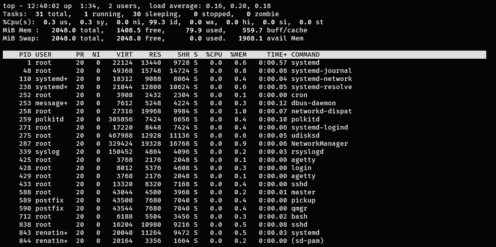
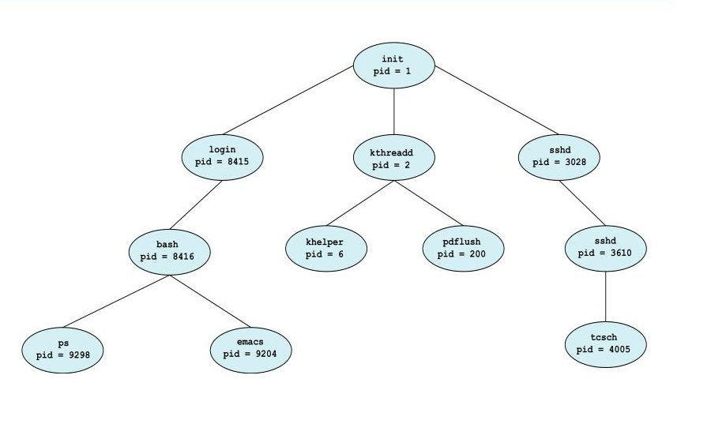

- [x] Oque é o linux
- [x] Estrutura de Diretórios
- [x] Navegação no terminal
- [x] Arquivos
	- [x] permissões
	- [x] Link simbólico e Hard Link

- [x] Usuários
	- [x] criar usuário/modificar/excluir
	- [x] grupos/modificar/excluir
	- [ ] sudo
- [ ] Processos
	- [ ] oq são
	- [ ] manipular processos
- [ ] User space/Kernel Space
- [ ] SystemCTL
- [ ] Demons / processos em segundo plano
- [ ] Redes
- [ ] Programas
	- [ ] Samba
	- [ ] DHCP
- [ ] terminal
- [ ] Principais comandos
-[ ] Programas
  - [ ] Config samba
  - [ ] Apache
- [x] Principais comandos

## O que é Linux

O Linux é o kernel do sistema operacional. Ou seja, ele é responsável por todas as operações de baixo nível do sistema. O Linux foi desenvolvido por [Linus Torvalds](https://en.wikipedia.org/wiki/Linus_Torvalds) com base no Unix.

Por volta de 1983, surgiu o projeto **GNU**, cujo nome é um acrônimo para _GNU's Not Unix_. Ele foi criado por [Richard Stallman](https://en.wikipedia.org/wiki/Richard_Stallman) com o objetivo de desenvolver um sistema operacional de software livre. Apesar de muitos avanços, o projeto enfrentava alguns problemas, principalmente relacionados a _**[task scheduling](https://en.wikipedia.org/wiki/Task_scheduler)**_ e **[timesharing](https://en.wikipedia.org/wiki/Incompatible_Timesharing_System)**. Esses problemas foram solucionados quando Stallman decidiu utilizar o kernel criado por Linus, em vez de desenvolver um próprio. Assim, surgiu o **GNU/Linux**.

## Estrutura de Arquivos


Um computador executa diversas instruções por segundo. Para que essas instruções sejam processadas, o sistema precisa buscá-las de algum lugar, nesse caso, da memória principal, ou seja, da memória RAM.

Porém, há um problema: a memória RAM é um tipo de [memória volátil](#%5Evolatil), ou seja, seus dados são perdidos quando o computador é desligado. Muitas dessas informações precisam ser mantidas para uso futuro. Para isso, podemos utilizar a **memória secundária** (HDD e SSD).

O sistema, então, funciona da seguinte forma:


A **CPU** busca instruções apenas na memória principal. Para isso, há um processo ou **daemon** responsável por transferir as informações da **memória secundária** para a **memória principal**, garantindo que a **CPU** tenha acesso aos dados necessários. Da mesma forma, quando o sistema precisa armazenar informações processadas, esse processo move os dados da memória principal para a memória secundária.

> [!Nota] 2 - Memória Volátil ^volatil  
> Em termos simples, é um tipo de memória que necessita de energia para manter as informações. Ou seja, assim que o computador é desligado, os dados são perdidos.
### Virtual File System

A forma como os arquivos são armazenados pode gerar uma série de problemas, desde corrupção parcial até a total inacessibilidade dos dados. Existem diversas maneiras de evitar isso, e o GNU/Linux optou por utilizar o **VFS** (_Virtual File System_ ou Sistema de Arquivos Virtual). Como o nome sugere, ele cria uma interface virtual que gerencia atributos como nome, data de criação, modificação, local no disco etc. O sistema se comunica com essa interface, que é responsável por realmente salvar o arquivo, evitando assim muitos problemas de corrupção de dados.

Além disso, o **VFS** torna o acesso a arquivos uniforme. Ou seja, para o sistema, todos os arquivos parecem estar em um mesmo tipo de armazenamento, mas, nos bastidores, eles podem estar sendo acessados em diferentes sistemas de arquivos, como **ext4**, **SMB**, **NFS**, entre outros.


### Organização de diretórios

Todo sistema operacional possui sua própria forma de organizar informações, e no Linux não é diferente. Ele estrutura seus diretórios em um esquema de árvore, onde todos os arquivos são mapeados dentro de uma única hierarquia. O ponto de partida dessa estrutura é o diretório raiz, representado por **"/"**.

A palavra _root_ significa "raiz" em inglês, e é por isso que o usuário administrador do Linux é chamado de **root**.

**Observações sobre o sistema de arquivos do GNU/Linux:**

#### Especificando Caminhos

No GNU/Linux, a separação de diretórios é feita com a **barra normal ( / )**, diferentemente do Windows, que usa a **barra invertida ( \ )**.

**Exemplo:**

- No Windows: `C:\Meus Documentos\Trabalho`
- No GNU/Linux: `/home/usuario/Documents/Trabalho`

---

#### Partições, Diretórios e Unidades

Diferente do Windows, o GNU/Linux **não usa letras de unidade (C:, D:, E:)** para identificar dispositivos de armazenamento.

Em vez disso, **tudo no sistema de arquivos faz parte de uma única hierarquia**. Isso significa que não há distinção entre um diretório comum, uma partição ou até mesmo um dispositivo de rede — todos são montados dentro da mesma estrutura de diretórios.

---

#### Sensibilidade a Maiúsculas e Minúsculas

No GNU/Linux, os nomes de arquivos **são sensíveis a maiúsculas e minúsculas**. Ou seja, os arquivos abaixo são diferentes entre si:

```bash
documento.txt != Documento.txt != DOCUMENTO.TXT
```

Isso pode ser um detalhe importante ao manipular arquivos no terminal ou ao desenvolver scripts.

---

#### Extensões de Arquivo

Diferente do Windows, no GNU/Linux os arquivos **não precisam ter uma extensão** para funcionar corretamente.

Por exemplo, um arquivo pode ter a extensão `.txt`, mas não há nenhuma obrigação de que ele tenha um sufixo. Isso pode ser confuso para iniciantes, pois não há uma forma visual imediata de diferenciar arquivos comuns de diretórios apenas pelo nome.

---

#### Arquivos Ocultos

O GNU/Linux diferencia arquivos comuns de **arquivos ocultos**.

Normalmente, arquivos de configuração do sistema são ocultos para evitar modificações acidentais. No GNU/Linux, qualquer arquivo cujo nome começa com um **ponto ( . )** é considerado oculto.

**Exemplos:**

- Arquivo comum: `meuarquivo.txt`
- Arquivo oculto: `.meuarquivo.txt`

Para visualizar arquivos ocultos no terminal, use o comando:

```bash
ls -a
```


---
### Principais Diretórios 

Assim como no Windows, o **GNU/Linux** possui diversos diretórios reservados para funções específicas, como armazenar bibliotecas do sistema, guardar arquivos essenciais para a inicialização e organizar os arquivos dos usuários.

A seguir, exploramos os principais diretórios do sistema:


---

### Diretórios Fundamentais

#### **`/` (Raiz do sistema)**

O diretório **raiz** é o ponto de partida da hierarquia de arquivos no GNU/Linux. Todos os outros diretórios estão dentro dele. Apenas o **usuário root** tem permissão para escrever diretamente aqui.

#### **`/bin` (Binários essenciais)**

Contém comandos básicos usados por todos os usuários, como:  
-  `ls`, `cp`, `grep`, `ping`, `cat`, etc.

#### **`/boot` (Arquivos de inicialização)**

Armazena arquivos essenciais para o **boot do sistema**, como:  
- O **kernel**, o **GRUB**, e imagens de inicialização (`initrd`).

#### **`/dev` (Dispositivos do sistema)**

Aqui estão representados os **dispositivos de hardware** como arquivos, incluindo:  
-  Terminais (`tty`), **USBs**, dispositivos de rede, discos (`sda`, `sdb`, etc.).

#### **`/etc` (Configurações do sistema)**

Contém arquivos de configuração **do sistema e dos programas instalados**, além de **scripts de inicialização**.

#### **`/home` (Diretórios dos usuários)**

Cada usuário tem seu próprio diretório dentro de **`/home`**, onde ficam seus arquivos pessoais e configurações.  
-  Exemplo: `/home/joao`, `/home/maria`.

#### **`/lib` (Bibliotecas do sistema)**

Contém bibliotecas essenciais para os **binários em** `/bin` **e** `/sbin`.  
-  Exemplos: `lib*.so.*`, `ld*`.

#### **`/media` (Mídias removíveis)**

Ponto de montagem automático para **dispositivos removíveis** como CDs e pendrives.  
-  Exemplos: `/media/cdrom`, `/media/usb`.

#### **`/mnt` (Montagem manual de dispositivos)**

Usado para montagem manual de partições ou dispositivos.

#### **`/opt` (Softwares adicionais)**

Armazena softwares instalados manualmente ou de terceiros.  
-  Exemplo: Aplicações como **Tomcat**, **Monero**, etc.

---

### Diretórios do Sistema

#### **`/proc` (Informações do sistema e processos)**

É um sistema de arquivos virtual que fornece detalhes sobre os **processos em execução e o kernel**.

#### **`/root` (Diretório do root)**

Diretório pessoal do **usuário root**, equivalente ao `/home`, mas exclusivo para o administrador.

#### **`/sbin` (Binários do sistema)**

Contém comandos administrativos utilizados pelo **root**, como:  
-  `fsck`, `reboot`, `fdisk`, `ip`, `init`.

#### **`/srv` (Serviços do sistema)**

Armazena arquivos e dados utilizados por **servidores** como **FTP, HTTP** e **repositórios de controle de versão**.

#### **`/sys` (Informações sobre dispositivos e drivers)**

Fornece acesso a informações sobre o **hardware e o kernel**.

#### **`/tmp` (Arquivos temporários)**

Armazena arquivos **temporários do sistema** e dos usuários.  
-  Seu conteúdo é apagado ao reiniciar o sistema.

---

### Diretórios de Usuário

#### **`/usr` (Programas e bibliotecas de usuários)**

Contém programas, bibliotecas e arquivos compartilhados pelos usuários.

**Subdiretórios importantes em `/usr`:**

- **`/usr/bin`** → Binários de aplicativos de usuário (`firefox`, `vim`, etc.).
- **`/usr/include`** → Arquivos de cabeçalho para compilação.
- **`/usr/lib`** → Bibliotecas para os programas em `/usr/bin` e `/usr/sbin`.
- **`/usr/local`** → Para programas instalados manualmente a partir do código-fonte.
- **`/usr/sbin`** → Binários administrativos não essenciais (ex.: **daemons** de rede).
- **`/usr/share`** → Arquivos de documentação e ícones.
- **`/usr/src`** → Código-fonte do kernel e outros pacotes.
- **`/usr/X11`** → Arquivos do X Window System (interface gráfica).

---

### Diretórios de Logs e Dados Variáveis

#### **`/var` (Arquivos variáveis)**

Armazena dados que **mudam constantemente**, como logs, emails e caches.

**Subdiretórios importantes em `/var`:**

- **`/var/log`** → Arquivos de logs do sistema.
- **`/var/spool`** → Fila de impressão e e-mails pendentes.

---

###  **Resumo e Dicas**

- Todos os arquivos no Linux estão dentro de uma **única estrutura de diretórios**.
- O usuário comum **armazena seus arquivos em** `/home/usuario/`.
- O usuário root tem permissões especiais e seu diretório pessoal é **`/root`**.
- Os dispositivos são representados como **arquivos dentro de `/dev/`**.
- Arquivos de configuração ficam **dentro de `/etc/`**.
- Logs do sistema ficam **em `/var/log/`**.

> [!Tip]
**Dica para iniciantes:** Antes de provas de certificação, revise a estrutura de diretórios e a imagem acima para memorizar melhor a organização do sistema de arquivos!


--- 
## Navegação no terminal

Agora que já conhecemos os principais diretórios do Linux, vamos aprender a nos mover pelo sistema de arquivos usando o terminal.

Uma boa analogia é imaginar que estamos **no fundo do mar**, onde não podemos ver nada. Para nos localizarmos, usamos um **sonar**, que no terminal são os comandos de navegação. O primeiro deles é o **`pwd`**, que nos diz exatamente onde estamos.

> [!Tip] Dica:
> Sempre que tiver dúvidas sobre um comando, use:
> 
>  `man <comando>`
> Isso abrirá o manual completo do comando.
 
---

### **Localizando-se no Terminal**

#### **`pwd` (Print Working Directory)**

O comando `pwd` exibe o **caminho completo** do diretório em que você está no momento:

```bash
$> pwd    /home/usuario/Documents
```

Isso é útil para evitar confusão ao navegar entre os diretórios.

---

### **Listando Arquivos e Diretórios**

#### **`ls` (Listar arquivos e diretórios)**

O comando `ls` mostra o conteúdo do diretório atual:

```sh
$> ls arquivo1.txt  arquivo2.md  arquivo3.sh  diretorio1  executavel1
```

Por padrão, `ls` não diferencia arquivos e diretórios. Para obter mais detalhes, usamos a opção `-l`:


```bash
$> ls -l 
.rw-r--r--  0 finall 29 Jan 21:52  arquivo.txt 
.rw-r--r--  0 finall 29 Jan 21:52  arquivo2.sh 
drwxr-xr-x  - finall 29 Jan 21:52  diretorio1 
.rwxr-xr-x  0 finall 29 Jan 21:52  executavel1 
lrwxrwxrwx  - finall 29 Jan 21:52  link_exec -> executavel1`
```

Aqui, temos informações extras, como:

- **Primeira coluna** → Indica o tipo de arquivo:
    - **`d`** → Diretório
    - **`l`** → Link simbólico
    - **`-`** → Arquivo comum
- **Quarta coluna** → Se o arquivo for executável, terá **`x`** nas permissões.

>  Para mais detalhes sobre permissões de arquivos, veja: **[Linux#Permissões e Arquivos]**.

---

### **Mudando de Diretório**

#### **`cd` (Change Directory)**

O comando `cd` permite navegar entre diretórios:


```bash
$> cd <caminho>   # Vai para um diretório específico`
```

**Exemplos práticos:**

```bash
$> cd ~        # Vai para o diretório pessoal do usuário   
$> cd ..       # Sobe um nível na hierarquia de diretórios   
$> cd -        # Volta para o diretório anterior  
$> cd /        # Vai para o diretório raiz
```

Com essas ferramentas, você já pode começar a explorar o sistema de arquivos no Linux de forma eficiente!

---

###  **Busca e Localização de Arquivos**

```shell
$> find / -name "arquivo"        # Procura um arquivo pelo nome em todo o sistema 
$> find /home -type d -name "pasta" # Procura por diretórios com um nome específico 
$> find . -type f -size +10M     # Encontra arquivos maiores que 10MB 
$>locate <arquivo>                # Busca rapidamente arquivos indexados pelo sistema 
$> updatedb                      # Atualiza o banco de dados usado pelo locate 
$> which <comando>                 # Mostra o caminho de um comando executável 
```


### Removendo Arquivos

Para remover arquivos usamos o comando `rm` 

```shell
$> rm arquivo   # Exclui um arquivo
$> rm arquivo1 arquivo2 # O rm pode excluir mais de um arquivo
$> rm caminho/diretorio -r # Exclui um diretorio e tudo que tem dentro dele
```

O comando `rm` aceita **globbing (curingas)** como `*` e `?`:

```shell
$> rm A*O # Remove arquivos que começam com "A" e terminam com "O".
$> rm *.log # Remove todos os arquivos que terminam em `.log`.
```

> [!warning] Aviso
> Cuidado ao excluir um arquivo sempre confira o comando antes de executa uma vez que excluímos um arquivo perdemos os ponteiros que aponta para o bloco de dados no armazenamento.
## Permissões e Arquivos

No **GNU/Linux**, tudo é tratado como um arquivo, e isso inclui até dispositivos e processos. Quando usamos o comando `ls -l`, podemos ver as permissões e o tipo do arquivo. O primeiro caractere da exibição indica o tipo do arquivo.

Veja os principais tipos de arquivos:

- **Arquivos Regulares** (`-`):  
    Arquivos comuns de dados e arquivos executáveis.
    
- **Diretórios** (`d`):  
    Representam pastas ou diretórios no sistema.
    
- **Arquivos Especiais**:  
    Arquivos relacionados a dispositivos e recursos do sistema:
    
    - **Dispositivos de Blocos** (**`b`**): Usados para acessar dispositivos de armazenamento, como discos rígidos.
    - **Dispositivos de Caracteres** (**`c`**): Usados para acessar dispositivos que transferem dados byte a byte, como teclados e mouses.
    - **Links Simbólicos** (**`l`)**: Arquivos que apontam para outros arquivos ou diretórios.
- **Comunicação entre Processos (IPC)**:  
    Arquivos usados para comunicação entre diferentes processos do sistema:
    
    - **Sockets** (**`s`**): Usados para comunicação de rede.
    - **Pipes de Comunicação** (**`p`**): Usados para enviar dados entre processos.

Essas letras nos ajudam a identificar rapidamente o tipo de arquivo.

---

## Permissões de Arquivos

Todo arquivo no GNU/Linux tem um **dono** e um **grupo**. Quando um usuário cria um arquivo, as permissões padrão são determinadas pela configuração do **Umask**  do sistema (é possível alterar esse arquivo para personalizar as permissões padrões). Vamos analisar um exemplo:

### Arquivos

Imaginando que o usuário **aluno** pertencente ao grupo **alunos** cria um arquivo, as permissões padrão são:

- **Dono do arquivo** (**aluno**): pode ler e escrever no arquivo.
- **Grupo dono do arquivo** (**alunos**): pode apenas ler o arquivo.
- **Outros usuários**: podem ler o arquivo.

### Diretórios

Agora, se o mesmo usuário criar um diretório, as permissões padrão serão:

- **Dono do diretório** (aluno): pode ler, escrever e executar.
- **Grupo dono do diretório** (alunos): pode ler e executar.
- **Outros usuários**: podem ler e executar.

Essas permissões podem ser modificadas conforme necessário.

---

### Identificando o Tipo de Arquivo

Para obter mais informações sobre o tipo de um arquivo, podemos usar o comando `file`:

```bash
$> file arquivo1 arquivo1: Unicode text, UTF-8 text
```

Aqui, o comando nos informa **que** `arquivo1` é um arquivo de texto no formato **UTF-8**.

---

> [!warning] Aviso  
> Arquivos no **GNU/Linux** são complexos e envolvem conceitos como i-nodes, que determinam como os arquivos são armazenados e acessados. Se você se interessar por esses assuntos mais avançados, recomendo o livro **Sistemas Operacionais Modernos**, de **Andrew Tanenbaum**, ou pesquisar mais na internet.

---

### Lendo o Conteúdo de um Arquivo

Existem comandos para ler e visualizar o conteúdo dos arquivos:

#### `cat` (concatenate)

O comando `cat` exibe todo o conteúdo do arquivo na tela de uma vez:

```shell
$> cat arquivo1 isso é um texto muito longo
```
#### `more` (paginador)

O comando `more` exibe o conteúdo de forma paginada, útil para arquivos grandes. O conteúdo é exibido em partes, e você pode pressionar **Enter** para continuar. Para sair antes do fim, basta pressionar **q** (quit):

```shell 
$> more arquivo1 isso é um texto muito longo
```

O `more` cria um buffer e vai exibindo parte do conteúdo conforme você pressiona a tecla **Enter**.

> [!Tip] Aviso
> Para mais comandos de leitura de arquivo vá para [[Linux#📜 **3. Manipulação de Arquivos**]]
### Permissões

Lembra dessa saída ? vamos olhas com mais calma as permissões 

```shell
$> ls -l
.rw-r--r-- 0 finall 29 Jan 21:52 arquivo.txt
.rw-r--r-- 0 finall 29 Jan 21:52 arquivo2.sh
drwxr-xr-x - finall 29 Jan 21:52 diretorio1
.rwxr-xr-x 0 finall 29 Jan 21:52 executavel1
lrwxrwxrwx - finall 29 Jan 21:52 link_exec -> executavel1
```

Como vimos o primeiro carácter indica o tipo de arquivo, e os outros caracteres representam as permissões para o **Usuário** (**u**), **Grupo** (**g**)  e **Outros** (**o**):


```shell
.rwxr-xr-x 0 finall 29 Jan 21:52 executavel1

  .      rwx     r-x      r-x
  |       |       |        |
 Tipo   usuario  Grupo   Outros
```

Todos possuem 3 parâmetros 

- **r (read)** → Leitura (`4`)
- **w (write)** → Escrita (`2`)
- **x (execute)** → Execução (`1`)

**A representação numérica das permissões segue a **soma desses valores**:

| Número | Permissão                    | Equivalente em Letras |
| ------ | ---------------------------- | --------------------- |
| 0      | Nenhuma                      | `---`                 |
| 1      | Execução                     | `--x`                 |
| 2      | Gravação                     | `-w-`                 |
| 3      | Gravação e Execução          | `-wx`                 |
| 4      | Leitura                      | `r--`                 |
| 5      | Leitura e Execução           | `r-x`                 |
| 6      | Leitura e Gravação           | `rw-`                 |
| 7      | Leitura, Gravação e Execução | `rwx`                 |

--- 
#### **Alterando Permissões com `chmod`**

O comando `chmod` permite definir permissões usando **a notação octal**.

##### **Permissão de Execução para um Script**

Suponha que temos um script chamado `meuscript.sh` e queremos torná-lo executável:

```shell
chmod +x meuscript.sh
```

Isso equivale a:

```shell
chmod 755 meuscript.sh
```

- **7 (rwx)** → Dono pode ler, escrever e executar
- **5 (r-x)** → Grupo pode ler e executar, mas não escrever
- **5 (r-x)** → Outros podem ler e executar, mas não escrever

 O script agora pode ser executado com:

```shell
./meuscript.sh
```

---

##### **Criando um Arquivo Somente para Leitura**

Se quisermos que um arquivo `seguranca.txt` possa ser lido, mas **não modificado ou executado**, usamos:

```shell
chmod 444 seguranca.txt
```


- **4 (r--)** → Dono só pode ler
- **4 (r--)** → Grupo só pode ler
- **4 (r--)** → Outros só podem ler

 Qualquer tentativa de modificar o arquivo sem permissões adequadas resultará em erro.

---

##### **Permissão Total para o Dono, Nenhuma para Outros**

Se quisermos que apenas o dono tenha **todas as permissões** e os outros não possam fazer nada, usamos:

```shell
chmod 700 arquivo_privado.txt
```

- **7 (rwx)** → Dono tem todas as permissões
- **0 (---)** → Grupo não pode acessar
- **0 (---)** → Outros não podem acessar

 Ideal para arquivos confidenciais.

---

##### **Permissões para Diretórios**

Se quisermos dar **permissão total** ao dono e **acesso apenas de leitura/execução** ao grupo e outros para um diretório `meudiretorio/`, usamos:

```shell
chmod 755 meudiretorio/
```

- **7 (rwx)** → Dono pode ler, escrever e acessar
- **5 (r-x)** → Grupo pode ler e acessar
- **5 (r-x)** → Outros podem ler e acessar

 Útil para diretórios públicos onde apenas o dono pode modificar.

--- 
#### **chown mudando dono de arquivos**

O comando `chown` (change owner) no Linux é usado para **alterar o dono e o grupo** de um arquivo ou diretório.


```shell
chown novo_dono:novo_grupo arquivo
```

---

#### **Alterando o Dono e o Grupo de um Arquivo**

Suponha que temos um arquivo `documento.txt` e queremos alterar seu dono para `usuario1` e o grupo para `grupo1`:

```shell
chown usuario1:grupo1 documento.txt
```

 Agora, `documento.txt` pertence a `usuario1` e ao grupo `grupo1`.

Se quisermos alterar apenas o dono **sem modificar o grupo**, usamos:

```shell
chown usuario1 documento.txt
```

Se quisermos alterar o dono e grupo de **uma pasta e todo o seu conteúdo**, usamos `-R` (recursivo):

```shell
chown -R usuario1:grupo1 /minha_pasta
```

Isso aplica as mudanças para todos os arquivos dentro da pasta `/minha_pasta`.


> [!Warning] Aviso
> Novamente tem muito mais coisas que envolvem permissões no GNU/Linux e que inclusive se forem manuseadas erradas podem causar vulnerabilidades no sistema.

### Link simbólico e Hard Link

O que são "links"? em resumo um link nada mais é do'que um ponteiro para um arquivo no sistema de arquivo secundário, criar um link é como criar um atalho para um arquivo e existem dois tipos de links

**- Soft Link ou Symbolic Links**
**- Hard Link**


#### Hard Link

Ele aponta diretamente para o arquivo no sistema de arquivos, ou seja ele aponte diretamente para onde estão armazenados os blocos do arquivo dessa forma o **Hard Link** possui o mesmo **i-node** (não vou explicar **i-node** mais pense nele como um **id** do arquivo) do arquivo "original".

Por exemplo, ser tivermos um arquivo chamado 'arquivo.txt' e criarmos um **Hard Link** para ele em outra posição do sistema,  e excluímos o 'arquivo.txt' ainda conseguimos acessar o arquivo usando o **Hard Link**.

 vamos criar um Hard Link para o arquivo 'arquivo.txt' usando o comando `ln`

```shell
$> ln arquivo.txt hard_arquivo.txt
$> ls -li # lista os arquivos e mostra o i-node
24 -rw-r--r-- 2 finall finall 44 Jan 31 08:37 arquivo.txt
24 -rw-r--r-- 2 finall finall 44 Jan 31 08:37 hard_arquivo.txt
```

note que os arquivos possuem a mesma permissão e o mesmo **i-node** no caso o 24.  Inclusive note que eles possuem o mesmo tamanho
#### Symbolic  Link

Ele é muito semelhante a um atalho, cada link possuem um **i-node** separado que aponta para o arquivo original. Da mesma forma que os Hard Links, todas as alterações nos dados de um dos arquivos são refletidas no outro mas, essas alterações são feita no arquivo e não no link.

Diferente do **Hard Link** se apagarmos o arquivo original, o link simbólico não tem mais para onde apontar e para de funcionar.

vamos criar um **link simbólico** para o arquivo 'arquivo.txt' também usando o comando `ln` porem agora com o parâmetro `-s`

```shell
$> ln -s arquivo.txt link_arquivo.txt
$> ls -li # lista os arquivos e mostra o i-node
24 -rw-r--r-- 2 finall finall 44 Jan 31 08:37 arquivo.txt
24 -rw-r--r-- 2 finall finall 44 Jan 31 08:37 hard_arquivo.txt
25 lrwxrwxrwx 1 finall finall 11 Jan 31 08:37 link_arquivo.txt -> arquivo.txt
```

note que o **i-node** é diferente e que ele mostra onde esta o arquivo que ele aponta veja também que ele possuem todas as permissões para todos os usuários isso porque quem define as permissões é o arquivo original não o link.

---
Vamos fazer um teste, vamos guardar alguma coisa no 'arquivo.txt' e depois exclui-lo para ver colo ele se comporta:

```shell
$>  echo "isso é um texto muito complexo muito mesmo" > arquivo.txt

$> cat arquivo.txt
isso é um texto muito complexo muito mesmo
```

ser usarmos o `cat`  em ambos os links eles exibiram a mesma coisa:

```shell
$> cat hard_arquivo.txt
isso é um texto muito complexo muito mesmo

$> cat link_arquivo.txt
isso é um texto muito complexo muito mesmo
```

agora se excluirmos o arquivo.txt original:

```shell
$> rm arquivo.txt

$> cat hard_arquivo.txt
isso é um texto muito complexo muito mesmo

$> cat link_arquivo.txt
cat: link_arquivo.txt: No such file or directory
```

o hard link funcionou perfeitamente ja o link simbólico deu um erro de arquivo ou diretório não existe.

---
## Usuários

O **GNU/Linux** é um sistema **multiusuário**, ou seja, ele permite que vários usuários acessem o sistema simultaneamente. Para garantir um funcionamento organizado e seguro, é necessário gerenciar corretamente tanto os **usuários** quanto os **grupos**.

### Gerenciamento de Usuários

Cada usuário no **GNU/Linux** possui um nome, um identificador único (**ID**), **permissões** e **configurações de acesso**. Aqui estão os principais comandos para gerenciar usuários:

O linux armazena informações de usuários em um arquivo chamado `passwd`  e podemos editar esse arquivo para para modificar os usuários porem isso é trabalhoso então vamos usar alguns comandos para poder criar e gerenciar nosso usuarios.

#### Criando usuário

Para adicionar um novo usuário ao sistema, usamos o comando `useradd`. Por padrão, ele cria um diretório pessoal e configura algumas permissões básicas.

```shell
$> sudo useradd nome_do_usuario
```


**Adicionar um usuário com diretório pessoal e shell padrão**:  
Para especificar o diretório pessoal e o shell, usamos a opção `-m` e `-s`:

```shell
$> sudo useradd -m -s /bin/bash nome_do_usuario
```

#### **Alterar a senha de um usuário**:  

Para definir ou alterar a senha de um usuário, usamos o comando `passwd`:

```shell
$> sudo passwd nome_do_usuario
```


#### **Exibir informações de um usuário**:  
Para visualizar as informações de um usuário, incluindo o ID, grupos e outras configurações, usamos o comando `id`:

```shell
$> id nome_do_usuario
```

#### **Alterar informações de um usuário**:  

Para modificar informações de um usuário (como o nome do usuário, diretório pessoal, etc.), usamos `usermod`:

```shell
$> sudo usermod -l novo_nome nome_do_usuario
```

#### **Excluir um usuário**:  

Para remover um usuário do sistema, podemos usar `userdel`. A opção `-r` também remove o diretório pessoal do usuário:

```shell
$> sudo userdel -r nome_do_usuario
```

#### **Listar todos os usuários**:  
Para listar todos os usuários do sistema, podemos consultar o arquivo `/etc/passwd`:

```shell
$> cat /etc/passwd
```


### Gerenciamento de Grupos

Os **grupos** permitem que você organize usuários com permissões semelhantes. Aqui estão os comandos para gerenciar grupos:

- **Adicionar um novo grupo**:  
Para criar um novo grupo no sistema, usamos o comando `groupadd`:


```shell
$> sudo groupadd nome_do_grupo
```

- **Adicionar um usuário a um grupo**:  
Para adicionar um usuário a um grupo existente, usamos o comando `usermod` com a opção `-aG`:


```shell
$> sudo usermod -aG nome_do_grupo nome_do_usuario
```


- **Remover um usuário de um grupo**:  
Para remover um usuário de um grupo, usamos o comando `gpasswd`:

```shell 
sudo gpasswd -d nome_do_usuario nome_do_grupo
```

- **Exibir os grupos aos quais um usuário pertence**:  
Para listar os grupos aos quais um usuário pertence, podemos usar o comando `groups`:


```shell
groups nome_do_usuario
```

- **Excluir um grupo**:  
Para excluir um grupo, usamos o comando `groupdel`:

```shell
$> sudo groupdel nome_do_grupo
```

- **Listar todos os grupos**:  
Para listar todos os grupos do sistema, podemos consultar o arquivo `/etc/group`:


```shell 
$> cat /etc/group
```


---

### Comandos Adicionais de Gerenciamento

Além dos comandos básicos para usuários e grupos, há outros comandos úteis para administrar o sistema de forma eficiente:

- **Verificar quais usuários estão logados**:  
Para verificar os usuários que estão atualmente logados no sistema, usamos o comando `who`:


```shell
$> who
```

- **Mostrar o histórico de login de um usuário**:  
Para visualizar os logins passados de um usuário, usamos o comando `last`:

```shell
$> last nome_do_usuario
```

- **Verificar detalhes sobre a conta de um usuário**:  
Para obter informações detalhadas sobre uma conta de usuário, podemos usar o comando `chage`:


```shell
$> sudo chage -l nome_do_usuario
```


### Privilégios de Usuários

Um dos principais conceitos de segurança do mundo **Linux** e **Unix** é utilizar um usuário com permissões limitadas e so quando necessário escalar o privilegio, para isso usamos um programa muito bem difundido nas distribuições **linux** que o **SUDO**.

Mas vamos em partes, existem três maneiras básicas de obter privilégios de root.

#### Login como root

o método mais simples é logar direto como **root** (algumas configurações não permitem login direto como **root** sendo necessário outra alternativa)

#### Usando SU 

Fazer login como **root** não é uma boa ideia afinal de contas criamos um outro usuário justamente para limitarmos as permissões do nosso usuário.

Por isso podemos usar o `su`, "substitute user"  para mudar de usuário. Assim podemos logar com nosso usuário e so elevar  nosso privilegio quando for necessário. 

```shell
$> su
```

sera solicitado a senha do usuário root e podemos executar os comando, e para voltar para o nosso usuário antigo podemos executar:

```shell
$> exit
```

> [!warning] Nota
> O `su` não serve somente para logar como **root** podemos especificar qual usuário queremos logar, `su usuario2`   

#### SUDO

Finalmente vamos falar do **sudo** uma forma de executar um comando com privilégios de root sem a necessidade de iniciar um novo terminal. 

```shell
$> sudo <comando>
```

sera solicitado a senha do usuário atual.

Devido às suas implicações de segurança, o acesso `sudo` não é concedido a usuários por padrão e deve ser configurado antes de funcionar corretamente. O `sudo` é configurado a partir do arquivo `/etc/sudoers`.

> [!danger] Aviso
> Para editar diretamente o arquivo `sudoers`  por motivos de segurança é recomendado utilizar o `visudo`.


#### Conceder privilégios **sudo** a um usuário

Podemos adicionar um usuário ao **grupo** sudo para conceder privilégios de root:

```shell
$> sudo usermod -aG sudo <usuario>
```

ou podemos utilizar:

```shell
$> sudo gpasswd -a <usuario> sudo
```

> [!tip] Nota
> No **CentOS** é um pouco diferente a configuração do **sudo**.


---

## Programas e Processos

No linux podemos dizer que existem dois grupos principais de arquivos no linux Sendo eles :
- **Arquivos de repositório;**
- **Arquivos executáveis;**

Os **arquivos de repositório** são utilizados como armazenamento de dados, ele são usados para configurações de programas. 

Já os **arquivos executáveis** executam ações no sistema sendo elas scripts ou um programa GUI completo.

O que diferencia um arquivo executável é um unico bit ativo conhecido como bit-magico, dessa forma o **SO** interpreta o arquivo de uma forma especial.

> [!tip] Dica
> Os arquivos executáveis também são chamados de binários

### Criando um Arquivo executável 

Para esse exemplo vamos criar um arquivo executavel em **C**.

Vamos criar um arquivo chamado  `exe.c` bem simples em **C** :

```C
 #include <stdio.h>

 int main() {
   printf("Isso foi executado pelo sistema\n");
   return 0;
 }
```

agora vamos utilizar do **gcc** para compilarmos nosso programa `gcc exe.c -o exe`.

Usando o `ls -l` temos a seguinte saída:
```shell
.rwxr-xr-x   15k usuario  2 Mar 17:56   exe
.rw-r--r--    99 usuario  2 Mar 17:55   exe.c
```

Podemos ver uma diferença clara no tamanho dos arquivos e também nas suas permissões, note que o `exe` possui permissão para execução o compilador `gcc` ja faz esse trabalho, alem de compilar nosso arquivo e faz o trabalho de atribuir a permissão de execução para todos.

Vamos fazer alguns testes. Primeiro vamos executar nosso arquivo:

```shell
 $> ./exe
Isso foi executado pelo sistema
```
 usamos o `./` para que o terminal saiba que precisa buscar no diretório que estamos, e vemos que ele executou perfeitamente.
 
E se nos retirarmos a permissão de execução do arquivo ?

```shell
$> chmod -x exe
$> ls -la
Permissions Size User   Date Modified Name
.rw-r--r--   15k finall  2 Mar 17:56   exe
.rw-r--r--    99 finall  2 Mar 17:55  exe.c
```
Pronto sem permissão agora vamos executar : 

```shell
$> ./exe
zsh: permission denied: ./exe
```

Ele não executa, e o nosso arquivo retorna um erro dizendo que não temos permissão para executar esse arquivo.

- - - 

Um **Processo** nada mais é do que um programa que esta em execução. Quando começamos a executar um programa o **SO** atribui um **PID** (Process ID) para que o processo possa ser identificado e gerenciado, cada processo possui um PID exclusivo e independe de outros processo possibilitando a execução de múltiplos processos ao mesmo tempo.

usando o **top** podemos ver os processos que estão:
 


> [!Tip] Dica
> O top é uma ferramenta muito boa porem existem substitutos melhores como o **htop** e o **btop** 

Note que alem do PID podemos ver quem é o responsável pelo processo quando de memoria e CPU ele esta utilizando à quanto tempo ele esta executando e qual é o nome do processo.

### Hierarquia de Processos

Todos os processos do **linux** funcionam em uma hierarquia tendo um **processo pai** e possivelmente **processos filhos**. O processo **init** é o processo pai de todos os outros processo. Assim que iniciamos um novo processo ele tem o **init** como seu processo pai.




Cada processo possui seu próprio espaço de endereço, que é usado para armazenar código e dados desse processo. Este espaço de endereço é isolado de outros processos, evitando que um processo acesse a memória de outro processo. o kernel gerencia esse isolamento usando mecanismos de proteção de memória.

### Estados de Processos

Um processo pode ter diversos estados possíveis que são uteis para o sistema gerenciar os processo dentre os estados possíveis os principais são:

- **Running**: O processo esta atualmente em **execução** e executando alguma instrução.

- **Sleeping**: O processo está **aguardando** algum evento, como por exemplo esta esperando alguma entrada de dados ou esperando um recurso ficar disponível .

- **Stopped**:  O processo foi interrompido por um **sinal** e não esta mais executando no momento.

- **Zombie:** O processo terminou suas de executar suas instruções porem, ainda não foi recolhido pelo **processo pai**.


### Gerenciando Processos

Primeiramente precisamos compreender qual o estado dos processos no nosso sistema pra isso podemos usar o `top`  ou algum substituto, usaremos também   o `ps`:

```shell
$> ps aux
```

Este comando permite listar todos os processo de todos os **usuarios** que estão em execução.

Podemos enviar sinais para os processos que estão em execução, assim alterando seu estado, por exemplo podemos enviar um sinal para matar um processo e seus filhos. 

Existem vários sinais que podem ser enviados para processos no Linux, cada um com sua finalidade específica. Alguns dos sinais mais comumente usados incluem -

- **SIGTERM** - Este sinal é usado para encerrar um processo normalmente. Quando um processo recebe esse sinal, ele tem a chance de limpar seus recursos antes de sair.

- **SIGKILL** - Este sinal é usado para encerrar um processo à força. Quando um processo recebe este sinal, ele é imediatamente encerrado sem qualquer chance de limpar seus recursos.

- **SIGHUP** - Este sinal é usado para notificar um processo que seu processo pai foi encerrado. Quando um processo recebe esse sinal, normalmente espera-se que ele também termine.

- **SIGINT** - Este sinal é usado para interromper um processo. Normalmente é enviado quando o usuário pressiona Ctrl+C no terminal para interromper um processo em execução.

Para enviar um sinal para um processo no Linux, você pode usar o comando kill, seguido do ID do processo e do número do sinal. 

#### KILL 

O comando `kill` é usado para para processos que esta em execução. Para executar o comando precisamos saber qual é o **PID** do processo que queremos finalizar por exemplo:

```shell
$> ps aux

USER         PID %CPU %MEM    VSZ   RSS TTY      STAT START   TIME COMMAND
root        2143  0.0  0.1   4680  3840 pts/5    S    15:20   0:00 bash
root        2160  0.0  0.0   2744  1280 pts/4    R+   15:20   0:03 ./muito_loop
root        2161  0.0  0.1   5436  3584 pts/5    R+   15:20   0:00 ps aux

```

Vamos matar o processo do  `muito_loop` que é um programinha em **C** que executa um loop infinito. No nosso caso ele esta com o `PID` **2160** então:

```shell
$> kill 2160
```

pronto agora ele não esta mais executando.

O comando `Kill` pode ser usado para mandar qualquer **sinal** para o processo. Podemos listar todos os **sinais** possível podemos usar o `kill -l`:

```shell
 $> kill -l
1) SIGHUP       2) SIGINT       3) SIGQUIT      4) SIGILL       5) SIGTRAP
2) SIGABRT      7) SIGBUS       8) SIGFPE       9) SIGKILL     10) SIGUSR1
3) SIGSEGV     12) SIGUSR2     13) SIGPIPE     14) SIGALRM     15) SIGTERM
4) SIGSTKFLT   17) SIGCHLD     18) SIGCONT     19) SIGSTOP     20) SIGTSTP
5) SIGTTIN     22) SIGTTOU     23) SIGURG      24) SIGXCPU     25) SIGXFSZ
6) SIGVTALRM   27) SIGPROF     28) SIGWINCH    29) SIGIO       30) SIGPWR
7) SIGSYS      34) SIGRTMIN    35) SIGRTMIN+1  36) SIGRTMIN+2  37) SIGRTMIN+3
8) SIGRTMIN+4  39) SIGRTMIN+5  40) SIGRTMIN+6  41) SIGRTMIN+7  42) SIGRTMIN+8
9) SIGRTMIN+9  44) SIGRTMIN+10 45) SIGRTMIN+11 46) SIGRTMIN+12 47) SIGRTMIN+13
10) SIGRTMIN+14 49) SIGRTMIN+15 50) SIGRTMAX-14 51) SIGRTMAX-13 52) SIGRTMAX-12
11) SIGRTMAX-11 54) SIGRTMAX-10 55) SIGRTMAX-9  56) SIGRTMAX-8  57) SIGRTMAX-7
12) SIGRTMAX-6  59) SIGRTMAX-5  60) SIGRTMAX-4  61) SIGRTMAX-3  62) SIGRTMAX-2
13) SIGRTMAX-1  64) SIGRTMAX
```


- - - 
#### **killall**

O `killall` faz basicamente o mesmo que o `kill` porem ele ao inves de usar o **PID** para matar um processo ele utiliza o nome do processo por exemplo podemos para o  navegador firefox  podemos utilizar :

```shell
$> killall firefox
```

- - - 
#### **pstree**

O comando `pstree` assim como `ps` mostra os processo em execução mas ele exibe em forma hierárquica:

```shell
$> pstree
systemd-+-NetworkManager---3*[{NetworkManager}]
        |-2*[agetty]
        |-cron
        |-dbus-daemon
        |-login---bash
        |-master-+-pickup
        |        `-qmgr
        |-networkd-dispat
        |-polkitd---3*[{polkitd}]
        |-rsyslogd---2*[{rsyslogd}]
        |-sshd---sshd---sshd---bash---pstree
        |-systemd---(sd-pam)
        |-systemd-journal
        |-systemd-logind
        |-systemd-network
        |-systemd-resolve
        |-udisksd---5*[{udisksd}]
        `-wpa_supplicant
```

com ele podemos ter uma noção melhor de qual processo é responsável pelo outro. Podemos usar de exemplo o próprio comando `pstree` 

```shell
 |-sshd---sshd---sshd---bash---pstree
```

vemos que o processo pai é o `sshd` porque estamos em um terminal remoto via `ssh` inclusive vemos que o filho do `sshd` é o bash  e por fim o `pstree`.
#### **nice**

Todos os processos são escalonados pelo **SO** para a execução e ficam um determinado tempo em execução pela **CPU** e depois é trocado pelo próximo processo na fila. 

Uma forma de priorizar o nosso processo é fazer ele ter mais tempo de **CPU** e como fazemos isso ? Simples fazemos o nosso escalonar escolher ele mais vezes e para isso usamos o comando `nice`:

```shell

$> nice -n -20 meuprojeto  #a maior prioridade possivel
```

literalmente dizemos que o nosso processo é gente boa e por isso deve ser escalonado mais vezes.

O nice tem um range de -20 a 19, onde -20 é a maior prioridade e 19 a menor prioridade. Por padrão os processos são iniciados com 0 de nice. 
## SystemCTL


## SSH

## Samba

## User space Kernel Space


## Principais comandos

Um compilado com vários comandos, não todos os comandos mas pelo menos os mais utilizados no mundo GNU/Linux não é necessário decorar todos ele mas sim saber que eles existem e saber onde procurar caso precise. 

### 🖥️ **1. Comandos de Informações do Sistema**

📌 Exibir informações sobre o sistema e usuário

```shell
uname -a              # Informações do sistema operacional 
hostnamectl           # Nome do host e versão do sistema 
whoami                # Exibe o usuário atual 
who                   # Lista usuários logados 
id                    # Informações sobre o usuário e grupos 
uptime                # Tempo de atividade do sistema 
date                  # Exibe data e hora atuais 
cal                   # Mostra um calendário
```

---

### 📂 **2. Navegação e Manipulação de Diretórios**

📌 Para se mover entre diretórios e gerenciá-los

```shell
pwd                   # Exibe o diretório atual 
ls                    # Lista arquivos no diretório atual 
ls -lah               # Lista arquivos com detalhes e tamanhos legíveis 
cd /caminho           # Muda para um diretório específico 
cd ~                  # Vai para a home do usuário 
cd ..                 # Sobe um nível no diretório 
mkdir nome_pasta      # Cria um diretório 
rmdir nome_pasta      # Remove um diretório vazio 
rm -rf nome_pasta     # Remove um diretório com todos os arquivos (cuidado!) 
tree                  # Exibe estrutura de diretórios em árvore (precisa instalar)
```

---

### 📜 **3. Manipulação de Arquivos**

📌 Criar, copiar, mover e remover arquivos


```shell
touch arquivo.txt      # Cria um arquivo vazio 
cp arquivo1 arquivo2   # Copia um arquivo
mv arquivo1 arquivo2   # Move ou renomeia um arquivo 
rm arquivo.txt         # Remove um arquivo 
find / -name "arquivo" # Busca um arquivo pelo nome 
locate arquivo         # Localiza arquivos rapidamente (precisa updatedb) 
updatedb               # Atualiza banco de dados do locate 
stat arquivo.txt       # Exibe informações detalhadas de um arquivo 
file arquivo           # Identifica o tipo de arquivo
```

---

### 📝 **4. Leitura e Edição de Arquivos**

📌 Visualizar e editar arquivos


```shell
cat arquivo.txt       # Exibe o conteúdo do arquivo 
tac arquivo.txt       # Exibe o conteúdo ao contrário 
less arquivo.txt      # Exibe conteúdo de forma paginada 
more arquivo.txt      # Similar ao less, mas mais simples
head -n 10 arquivo    # Exibe as primeiras 10 linhas do arquivo 
tail -n 10 arquivo    # Exibe as últimas 10 linhas do arquivo 
nano arquivo.txt      # Editor de texto simples no terminal 
vim arquivo.txt       # Editor de texto avançado no terminal 
sed 's/foo/bar/g' arquivo.txt  # Substitui "foo" por "bar" no arquivo
awk '{print $1}' arquivo.txt   # Extrai a primeira coluna do arquivo
```

---

### 🔑 **5. Permissões e Propriedades de Arquivos**

📌 Alterar permissões e donos de arquivos


```shell
ls -l                 # Exibe permissões dos arquivos
chmod 755 arquivo     # Altera permissões (rwxr-xr-x) 
chown usuario:grupo arquivo  # Altera dono e grupo do arquivo 
umask 022             # Define máscara de permissões padrão
```

---

### 🔄 **6. Processos e Tarefas**

📌 Monitorar e gerenciar processos

```shell
ps aux                # Lista processos ativos
top                   # Exibe processos em tempo real 
htop                  # Versão melhorada do top (precisa instalar) 
kill -9 PID           # Finaliza um processo pelo PID 
pkill -9 nome         # Finaliza processos pelo nome 
bg                    # Retorna um processo suspenso para o plano de fundo 
fg                    # Retorna um processo suspenso para o primeiro plano 
jobs                  # Lista processos suspensos 
nice -n 10 comando    # Define prioridade ao iniciar um processo 
renice -n 5 -p PID    # Altera prioridade de um processo em execução
```

---

### 🌐 **7. Gerenciamento de Rede**

📌 Configuração e diagnóstico de redes


```shell
ip a                  # Exibe interfaces e IPs 
ip r                  # Mostra a tabela de roteamento 
ping 8.8.8.8          # Testa conectividade com um host 
traceroute google.com # Mostra o caminho dos pacotes até um host
netstat -tulnp        # Lista portas abertas e processos (uso alternativo: ss -tulnp) 
dig google.com        # Obtém informações DNS 
nslookup google.com   # Consulta DNS de um domínio 
wget <URL>              # Baixa arquivos da internet 
curl -O <URL>          # Outra opção para baixar arquivos 
scp <arquivo> user@host:/destino  # Copia arquivos via SSH 
rsync -avz src/ dest/ # Sincroniza arquivos entre locais
```

---

### 🏗️ **8. Gerenciamento de Usuários e Grupos**

📌 Criar e gerenciar usuários

```shell
adduser usuario       # Cria um novo usuário 
passwd usuario        # Define/Altera senha de um usuário 
usermod -aG grupo usuario  # Adiciona usuário a um grupo 
deluser usuario       # Remove um usuário 
groupadd grupo        # Cria um novo grupo 
groups usuario        # Lista grupos do usuário 
id usuario            # Exibe detalhes do usuário e grupos
```

---

### 🖥️ **9. Gerenciamento de Serviços e Inicialização**

📌 Controlar serviços no sistema

```shell
systemctl start serviço     # Inicia um serviço 
systemctl stop serviço      # Para um serviço 
systemctl restart serviço   # Reinicia um serviço 
systemctl status serviço    # Mostra o status do serviço 
systemctl enable serviço    # Ativa um serviço na inicialização 
systemctl disable serviço   # Desativa um serviço na inicialização 
journalctl -xe             # Exibe logs do systemd
```

---

### 📦 **10. Gerenciamento de Pacotes**

📌 Instalar e remover programas

```shell
apt update && apt upgrade  # Atualiza pacotes (Debian/Ubuntu) 
apt install pacote         # Instala um pacote (Debian/Ubuntu) 
apt remove pacote          # Remove um pacote (Debian/Ubuntu) 
dpkg -i pacote.deb         # Instala um pacote .deb 
pacman -S pacote           # Instala um pacote no Arch Linux
```

---

### 💾 **11. Gerenciamento de Disco e Partições**

📌 Manipular discos e sistemas de arquivos

```shell
df -h                 # Mostra o uso do disco 
du -sh pasta          # Mostra o tamanho de uma pasta 
lsblk                # Lista dispositivos de armazenamento 
fdisk -l             # Lista e particiona discos 
mkfs.ext4 /dev/sdX   # Formata uma partição em ext4 
mount /dev/sdX /mnt  # Monta um dispositivo 
umount /mnt          # Desmonta um dispositivo 
fsck /dev/sdX        # Verifica e corrige erros no sistema de arquivos
```

---

### 📜 **12. Monitoramento de Logs**

📌 Acompanhar logs do sistema

```shell
tail -f /var/log/syslog     # Monitora logs do sistema 
tail -f /var/log/auth.log   # Monitora logs de autenticação 
journalctl -f               # Acompanha logs do systemd 
grep "erro" /var/log/syslog # Filtra logs por palavra-chave
```


## Bibliografia


- [Process](https://pt.linux-console.net/?p=23274)
- [Systemd.io](https://systemd.io)
- [Systemctl](https://www.geeksforgeeks.org/systemctl-in-unix/)
- [sudoers](https://www.digitalocean.com/community/tutorials/how-to-edit-the-sudoers-file)
- [Linux](https://linuxhandbook.com/systemctl-commands/)
