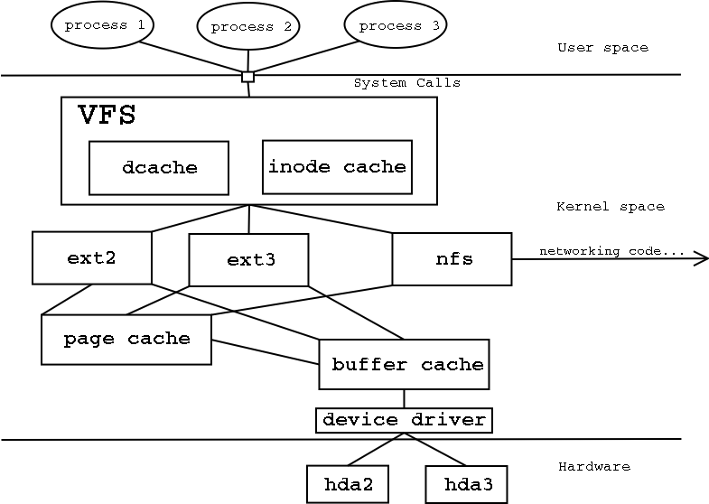
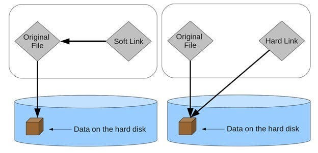

- [ ] Oque é o linux
- [x] Estrutura de Diretórios
- [x] Navegação no terminal
- [ ] Arquivos
	- [x] permissões
	- [ ] Link simbólico e Hard Link

- [ ] Usuários
	- [ ] criar usuário/modificar/excluir
	- [ ] grupos/modificar/excluir
- [ ] Processos
	- [ ] oq são
	- [ ] manipular processos
- [ ] User space/Kernel Space
- [ ] SystemCTL
- [ ] Demons / processos em segundo plano
- [ ] terminal
- [ ] Principais comandos


## O que é Linux

## Estrutura de Arquivos


Um computador realiza diversas instruções por segundo para que essas instruções sejam executadas é necessário o sistema buscar de algum lugar, esse lugar é a memoria principal ou seja a memoria ram. Porem temos um problema, a memoria ram é um tipo de [memoria volátil](#^volatil), e muitas dessas informação seria necessário manter para um uso futuro para isso podemos utilizar a **memoria segundaria**(HDD e SSD)  então o sistema funciona da seguinte forma: 


A **CPU** só busca instruções na memoria principal então temos um processo ou **Demon** que é responsável por buscar as informações que a **CPU** necessita na memoria segundaria e leva para a memoria principal e quando o sistema precisar guardar a informação que foi processada ele move da memoria principal para a segundaria.


>[!Nota] 2- Memoria Volátil ^volatil
> Em palavras simples é um tipo de memoria que necessita de energia para manter a informação ou seja assim que o computador é desligado a informação é perdida

### Virtual File System

A forma como os arquivos são armazenados podem gerar uma serie de problemas, desde corrupção parcial do arquivo até torná-lo completamente inacessível, existem diversas forma de evitar isso o GNU/Linux escolheu utilizar o VFS (Sistema de arquivos Virtual) que como o nome sugere ele cria uma interface virtual onde gerencial nome, data de criação, modificação, local no disco etc... então o sistema de comunica com essa interface e ela é responsável por realmente salvar o arquivo assim evitando muitos problemas de corrupção de arquivos. 

Alem disso o **VSF** torna a forma de acessar arquivos uniforme ou seja para o sistema ele esta acessando o mesmo tipo de armazenamento porem por baixo dos panos ele esta acessando arquivos em **ext4**, **SMB**, NFS, entre outros.




### Organização de diretórios

Todo sistema operacional tem sua forma de organizar suas informações e no linux não é diferente ele organiza seus diretórios em um esquema de arvore e seus ramos, todos os arquivos são mapeados dentro da mesma arvore, onde o diretório raiz é o "/" (raiz em ingles é root por isso o Usuário administrador do linux é conhecido como root).

**Observações sobre o sistema de arquivos do GNU/Linux:**

#### Especificando caminhos:
O GNU/Linux não usa a barra invertida (\\) para separar os componentes; ele usa barra (/) como alternativa. Por exemplo, como no Windows, os dados podem ser armazenados em` C:\Meus Documentos\Trabalho`, ao passo que, no GNU/Linux, eles seriam armazenados em `/home/usuario/Documents/Trabalho. `

#### Partição, diretórios e unidades: 
O GNU/Linux não usa letras de unidade para organizar a unidade como o Microsoft Windows faz, em um GNU/Linux não podemos dizer se estamos endereçando uma partição, um dispositivo de rede ou um diretório "comum" e um Drive pois todos os dispositivos estão montados dentro de uma mesma árvore. 

#### Sensibilidade a maiúsculas e minúsculas:
o sistema de arquivos GNU/Linux diferencia maiúsculas de minúsculas, ele distingue entre nomes de arquivo em letras maiúsculas e minúsculas.

#### Extensões de arquivo:
No GNU/Linux, um arquivo pode ter a extensão '.txt', mas não é necessário que um arquivo tenha uma extensão de arquivo, ao trabalhar com o Shell, ele cria alguns problemas para os iniciantes diferenciarem entre arquivos e diretórios.

#### Arquivos ocultos:
o GNU/Linux distingue entre arquivos padrão e arquivos ocultos, principalmente os arquivos de configuração estão ocultos no sistema operacional GNU/Linux, normalmente, não precisamos acessar ou ler os arquivos ocultos e os arquivos ocultos no GNU/Linux são representados por um ponto (.) Antes do nome do arquivo (por exemplo, .ignore).


#### Diretório / (chamado de raiz): 
Raiz da hierarquia primária e é o primeiro diretório. Ele contém todos os outros diretórios, ou seja, os subdiretórios e apenas o usuário root tem permissão para escrever aqui;

#### Diretório /bin (binários do usuário):
Ele contém os executáveis binários relacionados aos comandos Linux comuns usados por todos os usuários no modo de usuário único estão localizados neste diretório. Alguns arquivos presentes neste diretório são: ls, cp, grep, ping, cat, etc;

#### Diretório /boot (arquivos de inicialização boot):
Ele contém arquivos do carregador de boot, kernel, initrd, grub e outros arquivos e diretórios estão localizados neste diretório;

#### Diretório /dev (arquivos de dispositivo):
Ele contém os arquivos essenciais relacionados aos dispositivos conectados ao sistema, isso inclui dispositivos de terminal, USB, dispositivos de rede e quaisquer outros dispositivos de I/O que estejam conectados ao sistema; 

#### Diretório /etc (arquivos de configuração):
Este diretório tem um significado, ou seja, etc significa ‘edit to config’ este diretório contém os arquivos de configuração exigidos pelos programas instalados, os arquivos são configurações específicas do host e de todo o sistema, necessárias para o funcionamento adequado do sistema. Este diretório também contém scripts de shell para inicialização e desligamento do sistema que são usados para iniciar ou parar programas individuais. Alguns programas grandes e complexos estão neste diretório; 

#### Diretório /home (diretórios pessoais):
Este diretório contém os diretórios pessoais do usuário, contendo arquivos salvos e configurações pessoais. Cada usuário terá um diretório separado com seu nome de usuário nesse diretório, exceto o usuário root, porque toda vez que um novo usuário é criado, um diretório é criado no nome do usuário dentro do diretório inicial;

#### Diretório /lib (bibliotecas do sistema): 
Este diretório contém bibliotecas que são essenciais para os binários em /bin e /sbin, os nomes dos arquivos de biblioteca são ld* ou lib*.so.*, etc; 

#### Diretório /media (dispositivos de mídia removíveis):
Diretório temporário de montagem para mídia removível, como CD-ROM, por exemplo: /media/cdrom para CD-ROM; /media/floppy para unidades de disquete; /media/cdrecorder para gravador de CD;

#### Diretório /mnt (diretório de montagem):
Diretório de montagem temporário onde o administrador do sistema pode montar sistemas de arquivos;

#### Diretório /opt (pacotes de software de aplicativo opcionais):
Este diretório contém aplicativos complementares de fornecedores individuais, tal como Tomcat, Monero, etc; 

#### Diretório /proc (informações do processo):
Este é um sistema de arquivos virtual que fornece informações sobre o processo e o kernel. Esses arquivos neste diretório são gerados, preenchidos e excluídos automaticamente pelo sistema; 

#### Diretório /root (diretório raiz):
Este é o diretório inicial do usuário root; 

#### Diretório /sbin (binários do sistema):
Este diretório contém binários essenciais do sistema. Os comandos do GNU/Linux que estão localizados neste diretório são usados pelo administrador do sistema, para manutenção do sistema e propósito de configuração, por exemplo: fsck, reboot, fdisk, ip, init, etc;

#### Diretório /srv (dados de serviço):
Este diretório contém dados específicos do site servidos pelo sistema, como dados e scripts para servidores da web, dados oferecidos por servidores FTP e repositórios para sistemas de controle de versão, ou seja, dados relacionados a serviços específicos de servidor, por exemplo: /srv/cvs contém dados relacionados ao CVS, etc;

#### Diretório /sys (sistema):
Este diretório contém informações sobre dispositivos, drivers e alguns recursos do kernel. 

#### Diretório /tmp (arquivos temporários):
Este diretório contém arquivos temporários criados pelo sistema e os usuários que serão inicializados quando o sistema for reinicializado; 

#### Diretório /usr (programas do usuário):
Este diretório contém dados de usuário somente leitura, como binários, bibliotecas, documentação e código-fonte para programas de segundo nível, como utilitários de usuário e aplicativos;

#### Diretório /usr/bin:
contém arquivos binários para programas do usuário. Se você não conseguir encontrar um binário de usuário em /bin, devemos procurar em /usr/bin; 

#### Diretório /usr/include:
contém arquivos de inclusão padrão; Diretório /usr/lib: contém bibliotecas para os binários em /usr/bin e /usr/sbin; 

#### Diretório /usr/local: 
hierarquia terciária para dados locais. contém programas de usuários que você instala a partir de código fonte;

#### Diretório /usr/sbin:
contém arquivos binários para administradores de sistema. Se você não conseguir encontrar um binário do sistema em /sbin, você deve procurar em /usr/sbin. Ele também contém binários de sistema não essenciais, por exemplo: daemons para serviços de rede; 

#### Diretório /usr/share:
contém dados independentes de arquitetura (compartilhados); 

#### Diretório /usr/src:
contém o código fonte como fontes do kernel do GNU/Linux, arquivos de cabeçalho e documentação; 

#### Diretório /usr/X11:
contém arquivos relacionados ao X Window System; Diretório /var (arquivos variáveis): Este diretório contém arquivos cujo conteúdo deve ser alterado continuamente durante a operação normal do sistema - como logs, arquivos de spool e arquivo de e-mail temporário;

#### Diretório /var/log:
contém arquivos de log do sistema.  É importante que antes de uma prova de certificação se repasse todos estes diretórios, recomendo rever a imagem abaixo que possui uma síntese desta organização.


## Navegação no terminal


Agora que sabemos quais são os principais diretórios do linux  vamos finalmente nos mover particularmente eu gosto de pensar que estamos no fundo do mar onde não se pode ver nada então usamo de um sonar para nos situarmos, o sonar seriam os comandos como `pwd` que mostra em qual diretório você esta.

> [!tip] Dica
> Sempre que sentir duvida em um comando pode ser usar ```man < comando>```  para ter uma manual do comando.


**pwd** exibe o caminho do diretório atual, perfeito para se localizar no terminal:

```shell
$> pwd   
/home/usuario/Documents
```

---


**ls** lista os diretórios e arquivos dentro do diretório atual

```shell
$> ls
arquivo1.txt  arquivo2.md  arquivo3.sh  diretorio1  executavel1
```

O `ls` é um comando que pode ser utilizado com diversos parâmetros para facilitar a leitura note que na saída acima não conseguimos distinguir o'que é arquivo ou diretório(Quer dizer em alguns terminais os diretórios aparecem com cores diferente) podemos acrescentar `-l` para termos um pouco mais de informações:

```shell
$> ls -l
.rw-r--r-- 0 finall 29 Jan 21:52  arquivo.txt
.rw-r--r-- 0 finall 29 Jan 21:52  arquivo2.sh
drwxr-xr-x - finall 29 Jan 21:52  diretorio1
.rwxr-xr-x 0 finall 29 Jan 21:52  executavel1
lrwxrwxrwx - finall 29 Jan 21:52  link_exec -> executavel1
```

usando o `-l` temos diversas informações a mais como as permissões, quem é o dono do arquivo e a data de modificação do arquivo.

para saber mais sobre permissões vá para > [[Linux#Permissões e Arquivos]]  mas, vamos analisar apenas a primeira e a quarta coluna onde a primeira indica se é um diretório (d) ou um link (l) e na quarta coluna vemos se o arquivo é um executável pela presença do `x`.

---

O comando `cd` (change directory)  como o nome sugere ele serve para se mover entre os diretórios:

```shell
$> cd <caminho> # Vai para um diretório específico
```

Algumas formas se usar o comando `cd`:

```shell
$> cd ~        # Vai para o diretório home do usuário 
$> cd ..       # Sobe um nível na hierarquia de diretórios
$> cd -        # Volta para o diretório anterior
$> cd /        # Vai para o diretório raiz
```


---

###  **Busca e Localização de Arquivos**

```shell
$> find / -name "arquivo"        # Procura um arquivo pelo nome em todo o sistema 
$> find /home -type d -name "pasta" # Procura por diretórios com um nome específico 
$> find . -type f -size +10M     # Encontra arquivos maiores que 10MB 
$>locate <arquivo>                # Busca rapidamente arquivos indexados pelo sistema 
$> updatedb                      # Atualiza o banco de dados usado pelo locate 
$> which <comando>                 # Mostra o caminho de um comando executável 
```


### Removendo Arquivos

Para remover arquivos usamos o comando `rm` 

```shell
$> rm arquivo   # Exclui um arquivo
$> rm arquivo1 arquivo2 # O rm pode excluir mais de um arquivo
$> rm caminho/diretorio -r # Exclui um diretorio e tudo que tem dentro dele
```

O comando `rm` aceita **globbing (curingas)** como `*` e `?`:

```shell
$> rm A*O # Remove arquivos que começam com "A" e terminam com "O".
$> rm *.log # Remove todos os arquivos que terminam em `.log`.
```

> [!warning] Aviso
> Cuidado ao excluir um arquivo sempre confira o comando antes de executa uma vez que excluímos um arquivo perdemos os ponteiros que aponta para o bloco de dados no armazenamento.
## Permissões e Arquivos

No GNU/Linux muitas coisas no sistema são interpretadas apenas como arquivos e como vimos com o comando `ls -l` podemos ver o'que realmente é aquele arquivo baseado no primeiro caractere da exibição:

● Arquivos regulares ('**.**'): 
	 ○ Arquivos de dados; 	
	 ○ Arquivos executáveis;
● Diretórios ('**d**'); 
● Arquivos especiais: 
	○ Dispositivos de Blocos ('**b**');  
	○ Dispositivos de Caracteres ('**c**'); 
	○ Links simbólicos ('**l**');
● Comunicação inter processos IPC: 
	○ Socket ('**s**');
	○ Pipes de comunicação ('**p**');

Todos os Arquivos que são criados possuem um dono e um grupo, por exemplo temos um usuário **aluno** que pertence ao grupo **alunos** se ele criar um arquivo a permissão padrão sera:

● O dono do arquivo (aluno) pode: ler e escrever no arquivo; 
● O grupo dono do arquivo (alunos) pode: ler o arquivo;
● Outros usuários podem: ler o arquivo;

Essas  regras são definidas pelo **Umask** do sistema operacional. Vimos como ficam a permissão padrão de um arquivo mas como seria se esse mesmo usuário cria-se um diretório: 

● O dono do diretório (aluno) pode: ler, escrever e executar;
● O grupo dono do diretório (alunos) pode: ler e executar;
● Outros podem: ler e executar;

Para ter mais informações de um determinado aquivo podemos utilizar o comando `file`:

```shell
$> file arquivo1
arquivo1: Unicode text, UTF-8 text
```

vemos que o `arquivo1` é um arquivo de texto e esta no padrão UTF-8.

> [!warning] Aviso
> Arquivos são muito complexos e involve uma serie de fatores e outros conhecimentos como i-nodes, caso fique interessado no assunto recomendo o livro de Sistemas Operacionais Modernos do  Andrew Tanenbaum ou vai de internet mesmo.

Para lermos as informações do arquivo nos podemos usar alguns comandos entre eles esta o `cat` e o `more`:

```shell
$> cat arquivo1
isso é um texto muito 
```

o `cat` mostra tudo que esta dentro do arquivo e converte para um formato de texto.

```shell
$> more arquivo1
isso é um texto muito
```

o `more` faz a mesma coisa do `cat` porem ele é usado para arquivos maiores onde ele cria um buffer e vai exibindo parte a parte do texto conforme o usuário vai apertando a tecla **Enter** e caso queira sair antes de acabar todo o texto pode simplesmente pressionar o **q** (quit).

> [!Tip] Aviso
> Para mais comandos de leitura de arquivo vá para [[Linux#📜 **3. Manipulação de Arquivos**]]
### Permissões

Lembra dessa saída ? vamos olhas com mais calma as permissões 

```shell
.rw-r--r-- 0 finall 29 Jan 21:52 arquivo.txt
.rw-r--r-- 0 finall 29 Jan 21:52 arquivo2.sh
drwxr-xr-x - finall 29 Jan 21:52 diretorio1
.rwxr-xr-x 0 finall 29 Jan 21:52 executavel1
lrwxrwxrwx - finall 29 Jan 21:52 link_exec -> executavel1
```

Como vimos o primeiro carácter indica o tipo de arquivo, e os outros caracteres representam as permissões para o **Usuário** (**u**), **Grupo** (**g**)  e **Outros** (**o**):


```shell
.rwxr-xr-x 0 finall 29 Jan 21:52 executavel1

  .      rwx     r-x      r-x
  |       |       |        |
 Tipo   usuario  Grupo   Outros
```

Todos possuem 3 parâmetros 

- **r (read)** → Leitura (`4`)
- **w (write)** → Escrita (`2`)
- **x (execute)** → Execução (`1`)

**A representação numérica das permissões segue a **soma desses valores**:

| Número | Permissão                    | Equivalente em Letras |
| ------ | ---------------------------- | --------------------- |
| 0      | Nenhuma                      | `---`                 |
| 1      | Execução                     | `--x`                 |
| 2      | Gravação                     | `-w-`                 |
| 3      | Gravação e Execução          | `-wx`                 |
| 4      | Leitura                      | `r--`                 |
| 5      | Leitura e Execução           | `r-x`                 |
| 6      | Leitura e Gravação           | `rw-`                 |
| 7      | Leitura, Gravação e Execução | `rwx`                 |

--- 
#### **Alterando Permissões com `chmod`**

O comando `chmod` permite definir permissões usando **a notação octal**.

##### **Permissão de Execução para um Script**

Suponha que temos um script chamado `meuscript.sh` e queremos torná-lo executável:

```shell
chmod +x meuscript.sh
```

Isso equivale a:

```shell
chmod 755 meuscript.sh
```

- **7 (rwx)** → Dono pode ler, escrever e executar
- **5 (r-x)** → Grupo pode ler e executar, mas não escrever
- **5 (r-x)** → Outros podem ler e executar, mas não escrever

 O script agora pode ser executado com:

```shell
./meuscript.sh
```

---

##### **Criando um Arquivo Somente para Leitura**

Se quisermos que um arquivo `seguranca.txt` possa ser lido, mas **não modificado ou executado**, usamos:

```shell
chmod 444 seguranca.txt
```


- **4 (r--)** → Dono só pode ler
- **4 (r--)** → Grupo só pode ler
- **4 (r--)** → Outros só podem ler

 Qualquer tentativa de modificar o arquivo sem permissões adequadas resultará em erro.

---

##### **Permissão Total para o Dono, Nenhuma para Outros**

Se quisermos que apenas o dono tenha **todas as permissões** e os outros não possam fazer nada, usamos:

```shell
chmod 700 arquivo_privado.txt
```

- **7 (rwx)** → Dono tem todas as permissões
- **0 (---)** → Grupo não pode acessar
- **0 (---)** → Outros não podem acessar

 Ideal para arquivos confidenciais.

---

##### **Permissões para Diretórios**

Se quisermos dar **permissão total** ao dono e **acesso apenas de leitura/execução** ao grupo e outros para um diretório `meudiretorio/`, usamos:

```shell
chmod 755 meudiretorio/
```

- **7 (rwx)** → Dono pode ler, escrever e acessar
- **5 (r-x)** → Grupo pode ler e acessar
- **5 (r-x)** → Outros podem ler e acessar

 Útil para diretórios públicos onde apenas o dono pode modificar.

--- 
#### **chown mudando dono de arquivos**

O comando `chown` (change owner) no Linux é usado para **alterar o dono e o grupo** de um arquivo ou diretório.


```shell
chown novo_dono:novo_grupo arquivo
```

---

#### **Alterando o Dono e o Grupo de um Arquivo**

Suponha que temos um arquivo `documento.txt` e queremos alterar seu dono para `usuario1` e o grupo para `grupo1`:

```shell
chown usuario1:grupo1 documento.txt
```

 Agora, `documento.txt` pertence a `usuario1` e ao grupo `grupo1`.

Se quisermos alterar apenas o dono **sem modificar o grupo**, usamos:

```shell
chown usuario1 documento.txt
```

Se quisermos alterar o dono e grupo de **uma pasta e todo o seu conteúdo**, usamos `-R` (recursivo):

```shell
chown -R usuario1:grupo1 /minha_pasta
```

Isso aplica as mudanças para todos os arquivos dentro da pasta `/minha_pasta`.


> [!Warning] Aviso
> Novamente tem muito mais coisas que envolvem permissões no GNU/Linux e que inclusive se forem manuseadas erradas podem causar vulnerabilidades no sistema.

### Link simbólico e Hard Link

O que são "links"? em resumo um link nada mais é do'que um ponteiro para um arquivo no sistema de arquivo secundário, criar um link é como criar um atalho para um arquivo e existem dois tipos de links

**- Soft Link ou Symbolic Links**
**- Hard Link**




#### Hard Link

Ele aponta diretamente para o arquivo no sistema de arquivos, ou seja ele aponte diretamente para onde estão armazenados os blocos do arquivo dessa forma o **Hard Link** possui o mesmo **i-node** (não vou explicar **i-node** mais pense nele como um **id** do arquivo) do arquivo "original".

Por exemplo, ser tivermos um arquivo chamado 'arquivo.txt' e criarmos um **Hard Link** para ele em outra posição do sistema,  e excluímos o 'arquivo.txt' ainda conseguimos acessar o arquivo usando o **Hard Link**.

 vamos criar um Hard Link para o arquivo 'arquivo.txt' usando o comando `ln`

```shell
$> ln arquivo.txt hard_arquivo.txt
$> ls -li # lista os arquivos e mostra o i-node
24 -rw-r--r-- 2 finall finall 44 Jan 31 08:37 arquivo.txt
24 -rw-r--r-- 2 finall finall 44 Jan 31 08:37 hard_arquivo.txt
```

note que os arquivos possuem a mesma permissão e o mesmo **i-node** no caso o 24.  Inclusive note que eles possuem o mesmo tamanho
#### Symbolic  Link

Ele é muito semelhante a um atalho, cada link possuem um **i-node** separado que aponta para o arquivo original. Da mesma forma que os Hard Links, todas as alterações nos dados de um dos arquivos são refletidas no outro mas, essas alterações são feita no arquivo e não no link.

Diferente do **Hard Link** se apagarmos o arquivo original, o link simbólico não tem mais para onde apontar e para de funcionar.

vamos criar um **link simbólico** para o arquivo 'arquivo.txt' também usando o comando `ln` porem agora com o parâmetro `-s`

```shell
$> ln -s arquivo.txt link_arquivo.txt
$> ls -li # lista os arquivos e mostra o i-node
24 -rw-r--r-- 2 finall finall 44 Jan 31 08:37 arquivo.txt
24 -rw-r--r-- 2 finall finall 44 Jan 31 08:37 hard_arquivo.txt
25 lrwxrwxrwx 1 finall finall 11 Jan 31 08:37 link_arquivo.txt -> arquivo.txt
```

note que o **i-node** é diferente e que ele mostra onde esta o arquivo que ele aponta veja também que ele possuem todas as permissões para todos os usuários isso porque quem define as permissões é o arquivo original não o link.

---
Vamos fazer um teste, vamos guardar alguma coisa no 'arquivo.txt' e depois exclui-lo para ver colo ele se comporta:

```shell
$>  echo "isso é um texto muito complexo muito mesmo" > arquivo.txt

$> cat arquivo.txt
isso é um texto muito complexo muito mesmo
```

ser usarmos o `cat`  em ambos os links eles exibiram a mesma coisa:

```shell
$> cat hard_arquivo.txt
isso é um texto muito complexo muito mesmo

$> cat link_arquivo.txt
isso é um texto muito complexo muito mesmo
```

agora se excluirmos o arquivo.txt original:

```shell
$> rm arquivo.txt

$> cat hard_arquivo.txt
isso é um texto muito complexo muito mesmo

$> cat link_arquivo.txt
cat: link_arquivo.txt: No such file or directory
```

o hard link funcionou perfeitamente ja o link simbólico deu um erro de arquivo ou diretório não existe.
## Usuários

O GNU/Linux é um sistema multi usuário ou seja ele funciona com múltiplos usuários ao mesmo tempo e para não virar bagunça precisamos  
### Gerenciar usuários

### Gerenciar Grupos


## Processos

## User space Kernel Space

## Principais comandos

Um compilado com vários comandos, não todos os comandos mas pelo menos os mais utilizados no mundo GNU/Linux não é necessário decorar todos ele mas sim saber que eles existem e saber onde procurar caso precise. 

### 🖥️ **1. Comandos de Informações do Sistema**

📌 Exibir informações sobre o sistema e usuário

```shell
uname -a              # Informações do sistema operacional 
hostnamectl           # Nome do host e versão do sistema 
whoami                # Exibe o usuário atual 
who                   # Lista usuários logados 
id                    # Informações sobre o usuário e grupos 
uptime                # Tempo de atividade do sistema 
date                  # Exibe data e hora atuais 
cal                   # Mostra um calendário
```

---

### 📂 **2. Navegação e Manipulação de Diretórios**

📌 Para se mover entre diretórios e gerenciá-los

```shell
pwd                   # Exibe o diretório atual 
ls                    # Lista arquivos no diretório atual 
ls -lah               # Lista arquivos com detalhes e tamanhos legíveis 
cd /caminho           # Muda para um diretório específico 
cd ~                  # Vai para a home do usuário 
cd ..                 # Sobe um nível no diretório 
mkdir nome_pasta      # Cria um diretório 
rmdir nome_pasta      # Remove um diretório vazio 
rm -rf nome_pasta     # Remove um diretório com todos os arquivos (cuidado!) 
tree                  # Exibe estrutura de diretórios em árvore (precisa instalar)
```

---

### 📜 **3. Manipulação de Arquivos**

📌 Criar, copiar, mover e remover arquivos


```shell
touch arquivo.txt      # Cria um arquivo vazio 
cp arquivo1 arquivo2   # Copia um arquivo
mv arquivo1 arquivo2   # Move ou renomeia um arquivo 
rm arquivo.txt         # Remove um arquivo 
find / -name "arquivo" # Busca um arquivo pelo nome 
locate arquivo         # Localiza arquivos rapidamente (precisa updatedb) 
updatedb               # Atualiza banco de dados do locate 
stat arquivo.txt       # Exibe informações detalhadas de um arquivo 
file arquivo           # Identifica o tipo de arquivo
```

---

### 📝 **4. Leitura e Edição de Arquivos**

📌 Visualizar e editar arquivos


```shell
cat arquivo.txt       # Exibe o conteúdo do arquivo 
tac arquivo.txt       # Exibe o conteúdo ao contrário 
less arquivo.txt      # Exibe conteúdo de forma paginada 
more arquivo.txt      # Similar ao less, mas mais simples
head -n 10 arquivo    # Exibe as primeiras 10 linhas do arquivo 
tail -n 10 arquivo    # Exibe as últimas 10 linhas do arquivo 
nano arquivo.txt      # Editor de texto simples no terminal 
vim arquivo.txt       # Editor de texto avançado no terminal 
sed 's/foo/bar/g' arquivo.txt  # Substitui "foo" por "bar" no arquivo
awk '{print $1}' arquivo.txt   # Extrai a primeira coluna do arquivo
```

---

### 🔑 **5. Permissões e Propriedades de Arquivos**

📌 Alterar permissões e donos de arquivos


```shell
ls -l                 # Exibe permissões dos arquivos
chmod 755 arquivo     # Altera permissões (rwxr-xr-x) 
chown usuario:grupo arquivo  # Altera dono e grupo do arquivo 
umask 022             # Define máscara de permissões padrão
```

---

### 🔄 **6. Processos e Tarefas**

📌 Monitorar e gerenciar processos

```shell
ps aux                # Lista processos ativos
top                   # Exibe processos em tempo real 
htop                  # Versão melhorada do top (precisa instalar) 
kill -9 PID           # Finaliza um processo pelo PID 
pkill -9 nome         # Finaliza processos pelo nome 
bg                    # Retorna um processo suspenso para o plano de fundo 
fg                    # Retorna um processo suspenso para o primeiro plano 
jobs                  # Lista processos suspensos 
nice -n 10 comando    # Define prioridade ao iniciar um processo 
renice -n 5 -p PID    # Altera prioridade de um processo em execução
```

---

### 🌐 **7. Gerenciamento de Rede**

📌 Configuração e diagnóstico de redes


```shell
ip a                  # Exibe interfaces e IPs 
ip r                  # Mostra a tabela de roteamento 
ping 8.8.8.8          # Testa conectividade com um host 
traceroute google.com # Mostra o caminho dos pacotes até um host
netstat -tulnp        # Lista portas abertas e processos (uso alternativo: ss -tulnp) 
dig google.com        # Obtém informações DNS 
nslookup google.com   # Consulta DNS de um domínio 
wget <URL>              # Baixa arquivos da internet 
curl -O <URL>          # Outra opção para baixar arquivos 
scp <arquivo> user@host:/destino  # Copia arquivos via SSH 
rsync -avz src/ dest/ # Sincroniza arquivos entre locais
```

---

### 🏗️ **8. Gerenciamento de Usuários e Grupos**

📌 Criar e gerenciar usuários

```shell
adduser usuario       # Cria um novo usuário 
passwd usuario        # Define/Altera senha de um usuário 
usermod -aG grupo usuario  # Adiciona usuário a um grupo 
deluser usuario       # Remove um usuário 
groupadd grupo        # Cria um novo grupo 
groups usuario        # Lista grupos do usuário 
id usuario            # Exibe detalhes do usuário e grupos
```

---

### 🖥️ **9. Gerenciamento de Serviços e Inicialização**

📌 Controlar serviços no sistema

```shell
systemctl start serviço     # Inicia um serviço 
systemctl stop serviço      # Para um serviço 
systemctl restart serviço   # Reinicia um serviço 
systemctl status serviço    # Mostra o status do serviço 
systemctl enable serviço    # Ativa um serviço na inicialização 
systemctl disable serviço   # Desativa um serviço na inicialização 
journalctl -xe             # Exibe logs do systemd
```

---

### 📦 **10. Gerenciamento de Pacotes**

📌 Instalar e remover programas

```shell
apt update && apt upgrade  # Atualiza pacotes (Debian/Ubuntu) 
apt install pacote         # Instala um pacote (Debian/Ubuntu) 
apt remove pacote          # Remove um pacote (Debian/Ubuntu) 
dpkg -i pacote.deb         # Instala um pacote .deb 
pacman -S pacote           # Instala um pacote no Arch Linux
```

---

### 💾 **11. Gerenciamento de Disco e Partições**

📌 Manipular discos e sistemas de arquivos

```shell
df -h                 # Mostra o uso do disco 
du -sh pasta          # Mostra o tamanho de uma pasta 
lsblk                # Lista dispositivos de armazenamento 
fdisk -l             # Lista e particiona discos 
mkfs.ext4 /dev/sdX   # Formata uma partição em ext4 
mount /dev/sdX /mnt  # Monta um dispositivo 
umount /mnt          # Desmonta um dispositivo 
fsck /dev/sdX        # Verifica e corrige erros no sistema de arquivos
```

---

### 📜 **12. Monitoramento de Logs**

📌 Acompanhar logs do sistema

```shell
tail -f /var/log/syslog     # Monitora logs do sistema 
tail -f /var/log/auth.log   # Monitora logs de autenticação 
journalctl -f               # Acompanha logs do systemd 
grep "erro" /var/log/syslog # Filtra logs por palavra-chave
```
